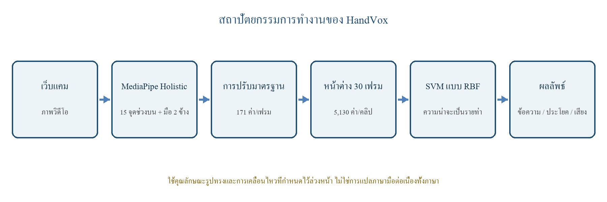

# HandVox

แอปเดสก์ท็อปสำหรับทดลองรู้จำภาษามือไทยจากกล้องแบบเรียลไทม์ แปลงท่าที่ตรวจพบเป็นประโยค และอ่านข้อความออกเสียง พัฒนาด้วย Python, MediaPipe, OpenCV และโมเดล Temporal Convolutional Network (TCN)

> [!IMPORTANT]
> HandVox ยังเป็นโครงการต้นแบบเพื่อการศึกษา โมเดลปัจจุบันมีสถานะ `experimental_unvalidated` และยังไม่ควรใช้แทนล่ามภาษามือหรือเป็นเครื่องมือสื่อสารในสถานการณ์ฉุกเฉิน

## ความสามารถหลัก

- ตรวจจับ landmark ของมือ ใบหน้า และลำตัวผ่าน MediaPipe
- รู้จำท่าจากลำดับการเคลื่อนไหว 30 เฟรมด้วยโมเดล TCN
- กรองผลด้วย confidence, probability margin และจำนวนเฟรมยืนยัน
- รวมคำที่ตรวจพบเป็นประโยค พร้อมแก้ไข คัดลอก บันทึกประวัติ และอ่านออกเสียง
- จัดการคำศัพท์และวางแผนคำใหม่จากหน้า GUI
- เก็บคลิป ตรวจคุณภาพข้อมูล เทรน และประเมินโมเดลผ่าน workflow เดียวกัน
- ประเมินโมเดลกับผู้ใช้ใหม่โดยแยกข้อมูลออกจากชุดฝึก
- ใช้ NVIDIA CUDA อัตโนมัติเมื่อพร้อม และ fallback เป็น CPU ได้

## คำศัพท์ในโมเดลปัจจุบัน

โมเดลที่มากับ repository รองรับคำที่แสดงต่อผู้ใช้ 17 คำ:

`สวัสดี` · `ขอโทษ` · `ไม่เป็นไร` · `ขอบคุณ` · `ใช่` · `ไม่ใช่` · `ช่วยด้วย` · `ห้องน้ำ` · `น้ำ` · `กิน` · `เจ็บ` · `หมอ` · `เข้าใจ` · `ไม่เข้าใจ` · `ต้องการ` · `หยุด` · `ไม่ต้อง`

ภายในโมเดลยังมีคลาส `neutral` และ `unknown` สำหรับลดการทำนายผิดเมื่อผู้ใช้ไม่ได้ทำท่าที่กำหนด

## ความต้องการของระบบ

- Windows 10 หรือ Windows 11
- Python 3.10 หรือ 3.11 แบบ 64-bit
- เว็บแคม สำหรับตรวจจับหรือเก็บข้อมูล
- อินเทอร์เน็ตในการติดตั้งครั้งแรก และเมื่อใช้ gTTS
- NVIDIA GPU ที่รองรับ CUDA เป็นทางเลือก ไม่จำเป็นต่อการเปิดใช้งาน

Python 3.12 ขึ้นไปยังไม่รองรับกับชุด dependency ที่ล็อกไว้ในโครงการนี้

## เริ่มใช้งาน

### 1. ดาวน์โหลดโครงการ

```powershell
git clone https://github.com/ORange11em/New-Hand-Sign-Translator-TH-.git
cd New-Hand-Sign-Translator-TH-
```

หรือดาวน์โหลด ZIP จาก GitHub แล้วแตกไฟล์

### 2. ติดตั้ง

ดับเบิลคลิกไฟล์:

```text
setup.bat
```

สคริปต์จะสร้าง `.venv`, ติดตั้ง dependency และเลือก PyTorch รุ่น CUDA หรือ CPU ให้ตามเครื่อง

### 3. เปิดแอป

ดับเบิลคลิก:

```text
HandVox.bat
```

หากยังไม่ได้ติดตั้งสภาพแวดล้อม `HandVox.bat` จะเรียกขั้นตอนติดตั้งให้อัตโนมัติ

## วิธีใช้งานแบบย่อ

1. เปิด HandVox และเลือกหน้า **ภาพรวม**
2. กด **เริ่มตรวจจับภาษามือ** แล้วอนุญาตให้เปิดกล้อง
3. ทำท่าให้อยู่ในกรอบจนระบบยืนยันคำ
4. ค้างท่าจนครบเวลาที่แถบสถานะแสดง ระบบจะเพิ่มคำลงในประโยค
5. กลับสู่ท่า `neutral` หรือเปลี่ยนท่า ก่อนเพิ่มคำเดิมอีกครั้ง
6. อ่าน บันทึก แก้ไข หรือล้างประโยคจากปุ่มด้านล่าง

แอปจะไม่เปิดกล้องเอง และจะถามยืนยันก่อนเริ่มตรวจจับทุกครั้ง

### คีย์ลัดหน้ากล้อง

| ปุ่ม | การทำงาน |
| --- | --- |
| `Space` | เพิ่มคำที่ยืนยันแล้ว |
| `Backspace` | ลบคำล่าสุด |
| `S` | อ่านประโยคและบันทึกตามการตั้งค่า |
| `B` | บันทึกประโยคโดยไม่อ่านเสียง |
| `Enter` | ล้างประโยค |
| `D` | แสดงหรือซ่อนรายละเอียดประสิทธิภาพ |
| `Esc` | ปิดหน้าต่างตรวจจับ |

## การเก็บข้อมูลและเทรนโมเดล

หน้า **เตรียมเทรน** แบ่ง workflow เป็น 5 ขั้น:

1. เลือกคำที่จะเพิ่ม
2. เก็บคลิปจากผู้ใช้และ session ที่กำหนด
3. ตรวจคุณภาพคลิปและทำ preflight
4. เทรน TCN และประเมินแบบ session holdout
5. ทดสอบกับผู้ใช้ใหม่ก่อนนำไปใช้งานจริง

ค่ามาตรฐานของโครงการคือ 16 คลิปต่อคนต่อคลาส แบ่งเป็น 4 session และควรมีคลิปที่ผ่านอย่างน้อย 14 คลิปต่อคนต่อคลาส การเพิ่มคำใหม่จะเทรนโมเดลใหม่รวมทุกคลาส ไม่ได้ต่อคลาสเข้ากับโมเดลเดิมโดยตรง

อ่านขั้นตอนทั้งหมดได้ใน [TRAINING_GUIDE.md](TRAINING_GUIDE.md)

## สถานะโมเดล

ตาม [model_manifest.json](model_manifest.json) โมเดลที่ติดตั้งใน repository มีข้อมูลดังนี้:

| รายการ | ค่า |
| --- | --- |
| Backend | Temporal TCN |
| Sequence length | 30 เฟรม |
| Feature count | 510 |
| Evaluation | Known-signers session holdout |
| Accuracy | 0.7615 |
| Macro F1 | 0.7937 |
| Deployment status | `experimental_unvalidated` |
| ผ่านเกณฑ์ acceptance | ไม่ผ่าน |

คะแนนนี้วัดจากผู้ใช้และ session ในชุดทดลองเดิม จึงไม่ใช่การรับรองความแม่นยำสำหรับผู้ใช้ใหม่ สภาพแสง มุมกล้อง หรือรูปแบบการทำท่าที่แตกต่างออกไป

## ภาพรวมสถาปัตยกรรม



กระบวนการหลักคือ กล้อง → MediaPipe landmarks → feature pipeline → ลำดับ 30 เฟรม → TCN → confidence policy → sentence state → GUI/TTS

## โครงสร้างโครงการ

```text
handvox/
├── app.py                         จุดเริ่มต้นของ GUI
├── handvox/                       business logic และหน้าจอหลัก
├── tests/                         ชุดทดสอบที่ไม่เปิดกล้อง
├── tools/                         เครื่องมือวิเคราะห์และสร้างรายงาน
├── dataset_v2/                    schema และ metadata ของข้อมูลฝึก
├── dataset_external_v2/           ข้อมูลสำหรับประเมินผู้ใช้ใหม่
├── experiments/                   ผลการเทรนและรายงานการประเมิน
├── gesture_model.pt               โมเดล TCN ที่ใช้งานอยู่
├── model_manifest.json            metadata และสถานะของโมเดล
├── training_config.json           แผนเก็บข้อมูลและเกณฑ์ผ่าน
├── HandVox.bat                    เปิดแอป
└── setup.bat                      ติดตั้งสภาพแวดล้อม
```

รายละเอียดเส้นทางการทำงานและหน้าที่ของแต่ละโมดูลอยู่ใน [CODE_GUIDE.md](CODE_GUIDE.md)

## ทดสอบโค้ด

หลังติดตั้งเรียบร้อย สามารถรันชุดทดสอบโดยไม่เปิดกล้อง ไม่เล่นเสียง และไม่เริ่มเทรนได้ด้วยคำสั่ง:

```powershell
.\.venv\Scripts\python.exe -m unittest discover -s tests -v
```

## ความเป็นส่วนตัว

- การตรวจจับปกติประมวลผลภาพจากกล้องภายในเครื่อง
- เมื่อปิดกล้อง ระบบบันทึกเฉพาะสถิติประสิทธิภาพลง `detector_performance_latest.json`
- การเก็บ Dataset เป็นการทำงานแยกต่างหากและต้องเริ่มโดยผู้ใช้
- gTTS ต้องใช้อินเทอร์เน็ต ส่วนเสียงออฟไลน์ใช้ `pyttsx3` เป็น fallback
- `settings.json`, ประวัติประโยค, log และคลิป Dataset จริงถูกกันออกจาก Git ด้วย `.gitignore`

## แก้ปัญหาเบื้องต้น

| อาการ | วิธีตรวจสอบ |
| --- | --- |
| เปิดแอปไม่ได้ | รัน `setup.bat` ใหม่และตรวจว่าใช้ Python 3.10/3.11 |
| กล้องไม่ขึ้น | ปิดโปรแกรมอื่นที่ใช้กล้อง แล้วตรวจ camera index ในหน้า **ตั้งค่า** |
| ตรวจท่าไม่ติด | จัดมือและลำตัวให้อยู่ในภาพ เพิ่มแสง และทำท่าต่อเนื่องจนเต็ม 30 เฟรม |
| อ่านเสียงไม่ได้ | ตรวจอินเทอร์เน็ตสำหรับ gTTS หรือเลือกเสียงออฟไลน์ |
| แอปปิดพร้อม error | เปิดดูรายละเอียดใน `handvox.log` |

## เอกสารเพิ่มเติม

- [วิธีใช้แบบย่อ](วิธีใช้.md)
- [คู่มือเก็บข้อมูลและเทรน](TRAINING_GUIDE.md)
- [แผนที่ซอร์สโค้ด](CODE_GUIDE.md)
- [รูปแบบ Dataset V2](dataset_v2/README.md)

## License

โครงการนี้ยังไม่ได้ระบุสัญญาอนุญาตใช้งาน ผู้ที่ต้องการนำโค้ด ข้อมูล หรือโมเดลไปเผยแพร่ต่อควรติดต่อเจ้าของ repository ก่อน
