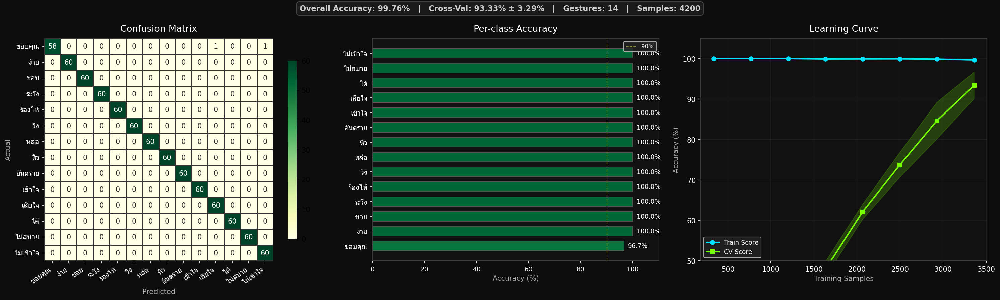

# HandVox — เครื่องแปลภาษามือไทยแบบเรียลไทม์

HandVox เป็นโปรเจ็กต์ตรวจจับท่ามือผ่านเว็บแคม แล้วแปลเป็นคำภาษาไทยบนหน้าจอพร้อมเสียงพูด ระบบใช้ MediaPipe สำหรับตรวจจับจุด landmark ของมือ และโมเดล SVM สำหรับจำแนกท่าทาง



## ความสามารถ

- ตรวจจับมือ 1 มือจากเว็บแคมแบบเรียลไทม์
- จำแนกท่ามือภาษาไทย 14 ท่า พร้อมแสดงค่าความมั่นใจ
- อ่านคำที่ตรวจพบด้วยเสียงพูด (TTS)
- สะสมคำเป็นประโยค และสั่งอ่านประโยคได้
- เก็บตัวอย่างท่ามือ เพิ่มท่าใหม่ และฝึกโมเดลใหม่ได้จากสคริปต์ที่เตรียมไว้
- มีไฟล์ `.bat` สำหรับใช้งานบน Windows โดยไม่ต้องพิมพ์คำสั่งเอง

## ท่ามือที่รองรับ

`ชอบ`, `เสียใจ`, `ร้องไห้`, `ง่าย`, `หิว`, `หล่อ`, `ขอบคุณ`, `ได้`, `ระวัง`, `อันตราย`, `ไม่สบาย`, `เข้าใจ`, `ไม่เข้าใจ`, `วิ่ง`

รายละเอียดและการตั้งค่าของแต่ละท่าอยู่ใน [gesture_config.py](gesture_config.py)

## ความต้องการของระบบ

- Windows 10/11
- Python **3.10 หรือ 3.11** (แนะนำ 3.10)
- เว็บแคม
- อินเทอร์เน็ตในครั้งแรกที่ติดตั้งไลบรารี และเมื่อใช้ gTTS สร้างเสียงพูด

> ไม่รองรับ Python 3.12 ขึ้นไป เนื่องจากเวอร์ชัน MediaPipe ที่ใช้ในโปรเจ็กต์นี้

## เริ่มใช้งานอย่างรวดเร็ว

1. ติดตั้ง Python 3.10 หรือ 3.11 จาก [python.org](https://www.python.org/downloads/) และเลือก **Add Python to PATH** ระหว่างติดตั้ง
2. ดาวน์โหลดหรือ clone โปรเจ็กต์นี้
3. ดับเบิลคลิก `HandVox.bat`
4. ครั้งแรกโปรแกรมจะเรียก `setup.bat` เพื่อสร้าง `.venv` และติดตั้งแพ็กเกจที่จำเป็น
5. เมื่อกลับสู่เมนู เลือก `1` เพื่อเริ่มตรวจจับท่ามือ

เมนูหลักใน `HandVox.bat`

| เมนู | การทำงาน |
| --- | --- |
| `1` | เริ่มตรวจจับและแปลท่ามือ |
| `2` | ฝึกโมเดลจากข้อมูลปัจจุบัน |
| `3` | เก็บตัวอย่างท่ามือ |
| `4` | ติดตั้งหรือซ่อมแซมแพ็กเกจ |
| `0` | ออกจากโปรแกรม |

## ใช้งานด้วยคำสั่ง

```bash
# สร้าง virtual environment และติดตั้งแพ็กเกจ
python -m venv .venv
.venv\Scripts\python -m pip install -r requirements.txt

# ฝึกโมเดลจาก gesture_data.csv
.venv\Scripts\python train_model.py

# เริ่มตรวจจับท่ามือ
.venv\Scripts\python run_detector.py
```

## ปุ่มลัดระหว่างตรวจจับ

| ปุ่ม | การทำงาน |
| --- | --- |
| `Space` | เพิ่มคำที่ตรวจพบล่าสุดลงในประโยค |
| `Backspace` | ลบคำสุดท้ายในประโยค |
| `Enter` | ล้างประโยค |
| `S` | อ่านประโยคปัจจุบันด้วยเสียงพูด |
| `Esc` | ปิดหน้าต่างตรวจจับ |

## เพิ่มท่ามือใหม่

1. เพิ่มชื่อท่า คำอธิบาย และสีใน `gesture_config.py`
2. เปิด `Collect_And_Train.bat`
3. ทำท่าตามคำแนะนำหน้าจอ แล้วกด `Space` เพื่อเริ่มเก็บข้อมูล
4. เก็บอย่างน้อย 300 ตัวอย่างต่อท่า ระบบจะข้ามท่าที่เก็บครบแล้ว
5. หลังเก็บข้อมูลเสร็จ สคริปต์จะฝึกโมเดลให้อัตโนมัติ
6. เปิด `Run_Detector.bat` เพื่อทดสอบ

ไฟล์สำคัญหลังการฝึก:

| ไฟล์ | หน้าที่ |
| --- | --- |
| `gesture_data.csv` | ชุดข้อมูล landmark ของมือและป้ายกำกับท่า |
| `gesture_model.pkl` | โมเดล SVM ที่ผ่านการฝึก |
| `gesture_labels.pkl` | ตัวเข้ารหัสชื่อคลาส |
| `training_results.png` | กราฟและผลการประเมินโมเดล |

## โครงสร้างโปรเจ็กต์

```text
.
├── HandVox.bat                # เมนูหลักสำหรับ Windows
├── setup.bat                  # สร้าง environment และติดตั้ง dependencies
├── collect_data.py            # เก็บตัวอย่างท่ามือจากเว็บแคม
├── train_model.py             # ฝึกและประเมินโมเดล SVM
├── run_detector.py            # ตรวจจับท่ามือและแสดงผลแบบเรียลไทม์
├── gesture_config.py          # รายการและคำอธิบายท่ามือ
├── gesture_data.csv           # ชุดข้อมูลที่ใช้ฝึก
└── requirements.txt           # ไลบรารีที่ต้องติดตั้ง
```

## การแก้ปัญหาเบื้องต้น

- **เปิดกล้องไม่ได้:** ตรวจสอบว่าแอปอื่นไม่ได้ใช้งานเว็บแคม และอนุญาต Camera permission ให้ Python
- **แจ้งว่าโมเดลเก่าหรือไม่ตรงกับข้อมูล:** เปิด `Train_Model.bat` เพื่อฝึกโมเดลใหม่
- **ข้อความไทยแสดงไม่สวย:** ตรวจสอบว่ามีฟอนต์ `TH Sarabun New` หรือ `Tahoma` ใน Windows
- **ติดตั้งแพ็กเกจไม่สำเร็จ:** ตรวจสอบว่าใช้ Python 3.10/3.11 และเชื่อมต่ออินเทอร์เน็ตแล้ว

## เทคโนโลยีที่ใช้

Python, OpenCV, MediaPipe, scikit-learn, Pandas, NumPy, Pillow, Matplotlib, Seaborn, gTTS และ Pygame

